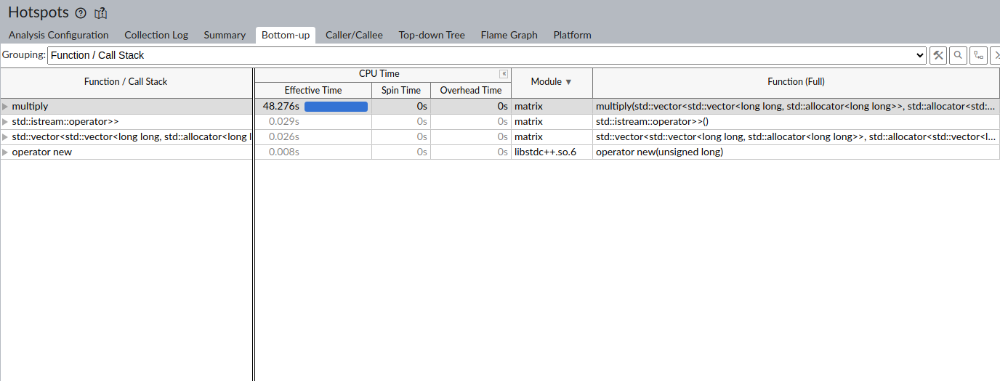

# Fast Matrix Exponentiation with Parallelization

#### Dragomir Andrei, Marinescu Alexandru, 343C1

## Overview

Let say we have n cities that are connected somehow to one another. If city A is connected to city B then we say that there is a road of length one between them, meaning it takes an hour to complete. We want to find out how many roads which would take k hours to complete are between any cities in the map. The naive solution would compute all the possible roads, but we have a better option.

This algorithm serves as a load balancer guide for very big maps in order to find out how many different ways we can route cars in order to avoid high traffic on long roads between multiple cities.

## Complexity

- **Time Complexity:** \( O(n^3 \cdot \log(k)) \)
- **Space Complexity:** \( O(n^2) \)

### Proposal

Our solution is to compute the power of the adjacency matrix of this graph of cities. But making that power of matrices will take a lot of time. For that we will use fast logarithmic exponentiation. We can do even better using parallel programming.

Let's say we want to find out all the roads which take 13 hours between some cities described by the matrix A.

**Matrix Powers:**

- \( A^{13} = A^8 \times A^4 \times A^1 \)
- \( A^8 = A^4 \times A^4 \)
- \( A^4 = A^2 \times A^2 \)
- \( A^2 = A \times A \)

## Architecture used

**12th Gen Intel(R) Core(TM) i7-12700H 2.30 GHz**

### Use of Parallelism

We will use MPI to distribute the computation of each power described on a different MPI worker. The other point of improvement is doing the actual matrix multiplication on threads, MPI, or OpenMP workers. This way, we can optimize every part of the algorithm.

## Requirements

- **C++11** or later (for modern C++ features)
- **MPI** (Message Passing Interface) for distributed parallelization
- **OpenMP** for shared-memory parallelization
- **Make** for building the project

### Size of inputs

We have 3 different input sizes: small, medium, and large.

- **small** - \( 100 \times 100 \)
- **medium** - \( 300 \times 300 \)
- **large** - \( 600 \times 600 \)
  All profiling tests have been run with \( k = 10^{6} \)


## Compilation

To compile the project, you can use the provided `Makefile` in each directory by running:

```bash
make
```

```bash
./matrix <input_file> <power> <city_i> <city_j>
```

```bash
Where input file is: ../in/<size>.txt where size is small, medium, large.
Power is the size of the road we are targetting.
City i is the source.
City j is the destination.
```

## Profiling



## Pseudocode

```bash
Function multiply(a, b, n)
  result = n x n matrix of 0s
  For i, j, k in 0..n-1
    result[i][j] = (result[i][j] + a[i][k] * b[k][j]) % MOD
  Return result

Function matrixExponentiation(base, exp, n)
  result = identity matrix n x n
  While exp > 0
    If exp % 2 == 1, result = multiply(result, base, n)
    base = multiply(base, base, n)
    exp = exp // 2
  Return result

Main function
  If argument count < 5, Print "Usage" and Exit
  Read filename, k, city_i, city_j from arguments

  Open file filename
  If file can't be opened, Print "Error" and Exit

  Read n from file
  If city_i or city_j not in [0, n-1], Print "Invalid index" and Exit

  adjMatrix = n x n matrix from file
  resultMatrix = matrixExponentiation(adjMatrix, k, n)

  Print "Paths of length " + k + " between " + city_i + " and " + city_j + ": " + resultMatrix[city_i][city_j


```
